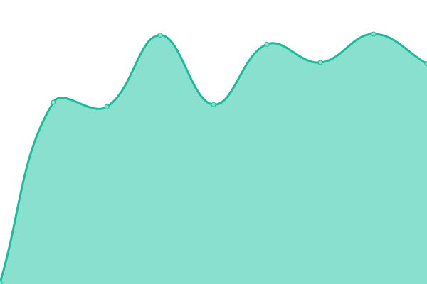

# [📈 Live Status](https://CoryManson.github.io/uptime): <!--live status--> **🟧 Partial outage**

This repository contains the open-source uptime monitor and status page for [CoryManson](https://CoryManson.github.io/uptime), powered by [Upptime](https://github.com/upptime/upptime).

With [Upptime](https://upptime.js.org), you can get your own unlimited and free uptime monitor and status page, powered entirely by a GitHub repository. We use [Issues](https://github.com/CoryManson/uptime/issues) as incident reports, [Actions](https://github.com/CoryManson/uptime/actions) as uptime monitors, and [Pages](https://CoryManson.github.io/uptime) for the status page.

<!--start: status pages-->
<!-- This summary is generated by Upptime (https://github.com/upptime/upptime) -->
<!-- Do not edit this manually, your changes will be overwritten -->
<!-- prettier-ignore -->
| URL | Status | History | Response Time | Uptime |
| --- | ------ | ------- | ------------- | ------ |
|  Homepage | 🟩 Up | [homepage.yml](https://github.com/CoryManson/uptime/commits/HEAD/history/homepage.yml) | 

 1082ms
     
 | 

<a href="https://CoryManson.github.io/uptime/history/homepage">98.80%</a>
    

|  Plex | 🟥 Down | [plex.yml](https://github.com/CoryManson/uptime/commits/HEAD/history/plex.yml) | 

 175ms
     
 | 

<a href="https://CoryManson.github.io/uptime/history/plex">98.81%</a>
    

|  Weather | 🟩 Up | [weather.yml](https://github.com/CoryManson/uptime/commits/HEAD/history/weather.yml) | 

 1234ms
     
 | 

<a href="https://CoryManson.github.io/uptime/history/weather">98.81%</a>
    

|  Tautulli | 🟩 Up | [tautulli.yml](https://github.com/CoryManson/uptime/commits/HEAD/history/tautulli.yml) | 

 555ms
     
 | 

<a href="https://CoryManson.github.io/uptime/history/tautulli">98.82%</a>
    

|  Ombi | 🟥 Down | [ombi.yml](https://github.com/CoryManson/uptime/commits/HEAD/history/ombi.yml) | 

 176ms
     
 | 

<a href="https://CoryManson.github.io/uptime/history/ombi">0.00%</a>
    

<!--end: status pages-->

[**Visit our status website →**](https://CoryManson.github.io/uptime)

## 📄 License

- Powered by: [Upptime](https://github.com/upptime/upptime)
- Code: [MIT](./LICENSE) © [CoryManson](https://CoryManson.github.io/uptime)
- Data in the `./history` directory: [Open Database License](https://opendatacommons.org/licenses/odbl/1-0/)
